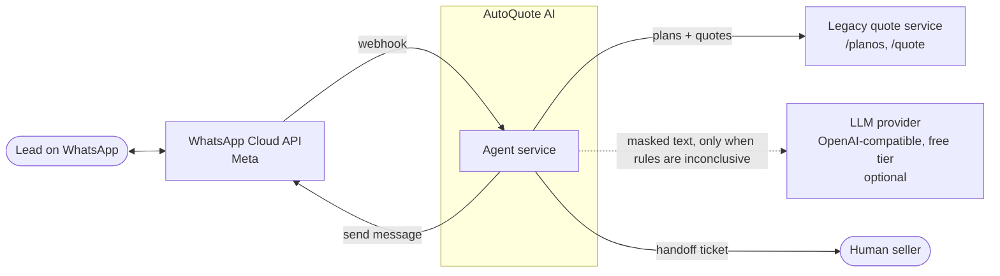
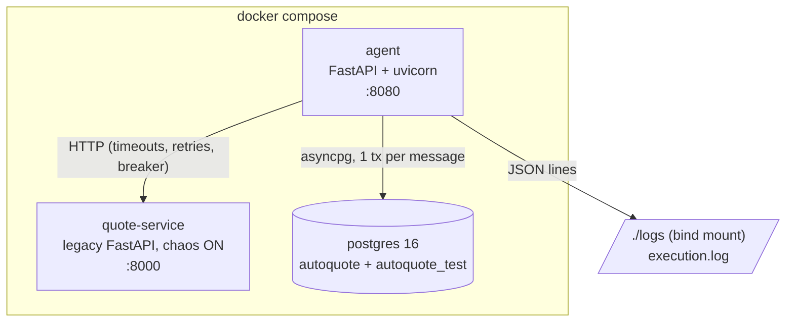
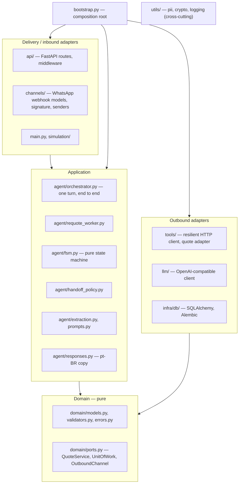
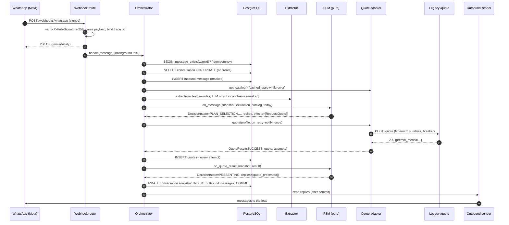
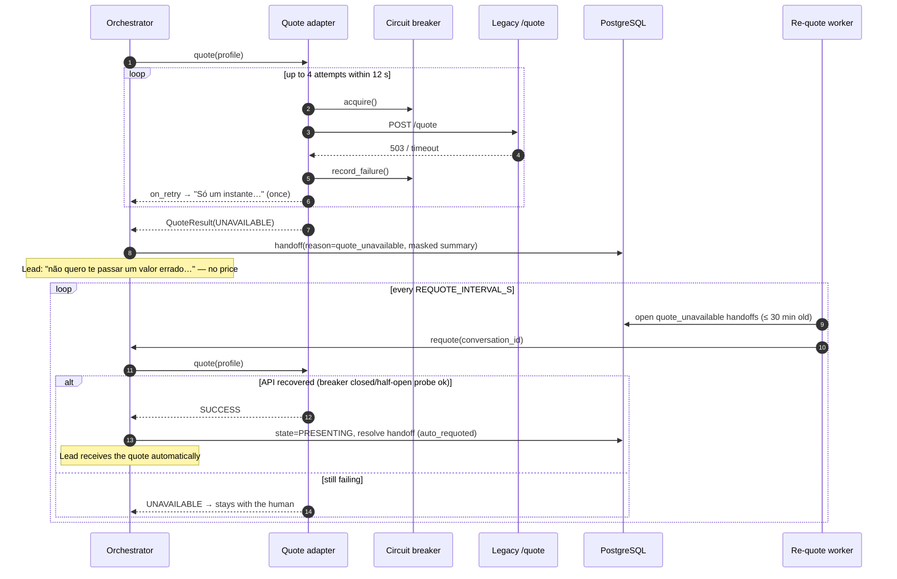

# Architecture

## 1. Goals and constraints

| Goal | How the architecture serves it |
|---|---|
| Quote leads end to end over WhatsApp | Webhook adapter → orchestrator → state machine → quote adapter |
| **Never stall, never invent a price** | Prices come only from the quote API's JSON. Every upstream call is bounded in time; failures lead to an explicit handoff |
| Explicit, defensible handoff criteria | One pure policy module (`handoff_policy.py`) with named reasons |
| Traceability | `trace_id` per turn, audit tables for messages, quotes (with every HTTP attempt) and handoffs |
| Care with personal data | Data minimisation (no CPF); masking at every boundary; encryption at rest |
| Run on a free LLM tier | Rules-first extraction; the LLM is optional, called rarely, and its failure is harmless |
| Easy to change and review | Hexagonal layering enforced by import contracts; pure, unit-tested core |

Constraints: Python 3.12, the legacy API is given and must not be changed, the
leads write in pt-BR, and the stack must run with one `docker compose up`.

## 2. System context

The handoff "channel" to sellers is the `handoffs` table and the `handoff_created` log
event (see [Operations § next steps](operations.md#7-scaling-and-next-steps) for a CRM
integration).

## 3. Containers (deployment view)

| Container | Image | Responsibility |
|---|---|---|
| `agent` | `Dockerfile` (`dev` target in compose, `runtime` for production) | Webhook API, orchestration, background re-quote worker, CLI (simulation/interactive) |
| `quote-service` | `quote-service/Dockerfile` | Vendored legacy API. Injects 5xx and slow responses (`QUOTE_FAILURE_RATE`, `QUOTE_SLOW_RATE`) |
| `postgres` | `postgres:16-alpine` | Conversation state and the audit trail. `autoquote_test` is created for in-container integration tests |

On start, the agent runs `alembic upgrade head` and then serves on `:8080`.

## 4. Layers (hexagonal architecture)

**Dependency rules** are enforced in CI by
[import-linter](https://import-linter.readthedocs.io/) contracts (`pyproject.toml`,
`make arch`):

1. `src.domain` imports no application code, adapters or I/O frameworks (`httpx`,
   `sqlalchemy`, `fastapi`, `structlog`).
2. `src.agent` depends on ports, never on concrete adapters (`infra`, `api`,
   `channels`), on the composition root, or on I/O frameworks.
3. Outbound adapters (`tools`, `llm`, `infra`) never import the application or delivery
   layers.
4. Only the composition root wires concrete adapters. Routes and channels cannot
   import the DB session factory, the LLM client or the HTTP client directly.

Why this matters: the decision logic (state machine, handoff policy, extraction rules)
is pure and covered by fast unit tests. Infrastructure can be swapped (another LLM,
another channel, a queue) without touching business rules.

## 5. Module map

| Path | Responsibility | Key types / functions |
|---|---|---|
| `src/config.py` | Typed settings from env / `.env` | `Settings`, `get_settings()` |
| `src/bootstrap.py` | Composition root: builds every adapter and wires the ports | `build_container()`, `Container` |
| `src/domain/models.py` | Value objects and entities | `LeadProfile`, `Plan`, `PlanCatalog`, `UnderwritingRules`, `Quote`, `ConversationSnapshot`, `ConversationState`, `HandoffReason` |
| `src/domain/validators.py` | Pure validation of lead input | `validate_age`, `validate_vehicle_year`, `normalize_zip_code`, `validate_start_date` |
| `src/domain/ports.py` | Interfaces the application depends on | `QuoteService`, `UnitOfWork`, `OutboundChannel`, `QuoteResult` |
| `src/agent/fsm.py` | State machine: events → `Decision(snapshot, replies, effects)` | `ConversationFSM`, `RequestQuote`, `OpenHandoff`, `Reply` |
| `src/agent/handoff_policy.py` | All handoff rules | `HandoffPolicy` |
| `src/agent/extraction.py` | Message → fields + intent | `RuleBasedExtractor`, `HybridExtractor`, `Intent` |
| `src/agent/prompts.py` | Versioned LLM prompt | `EXTRACTION_PROMPT_VERSION` |
| `src/agent/responses.py` | Renders replies (pt-BR); prices only from `Quote` | `render()` |
| `src/agent/orchestrator.py` | Application service for one turn | `Orchestrator.handle()`, `Orchestrator.requote()` |
| `src/agent/requote_worker.py` | Retries quotes after outages | `RequoteWorker` |
| `src/tools/resilience.py` | Retry policy, circuit breaker, clock | `RetryPolicy`, `CircuitBreaker`, `Clock` |
| `src/tools/http_client.py` | Timeouts, deadline, retries, breaker per call | `ResilientHttpClient` |
| `src/tools/quote_client.py` | Legacy contract ↔ domain, outcome classification | `HttpQuoteService` |
| `src/llm/openai_compat.py` | Any OpenAI-compatible chat endpoint, JSON mode | `OpenAICompatibleClient` |
| `src/infra/db/` | ORM models, unit of work, Alembic migrations | `SqlUnitOfWork` |
| `src/channels/whatsapp.py` | Webhook payload models, signature, senders | `parse_webhook`, `verify_signature`, `SimulatedWhatsAppSender`, `WhatsAppCloudSender` |
| `src/api/` | HTTP surface | `/webhooks/whatsapp`, `/health`, `/ready`, `/conversations/{id}` |
| `src/utils/` | Cross-cutting: PII masking, encryption/HMAC, JSON logging | `mask_text`, `FieldCipher`, `configure_logging` |
| `src/simulation/` | Scripted scenarios, fault injection | `SimulationRunner`, `FaultInjectingTransport` |

## 6. Runtime flows

### 6.1 One inbound message (happy path)

Design notes:
- **Effects loop.** The FSM never performs I/O. It returns effects, the orchestrator
  executes them and feeds their results back into the FSM (bounded to 4 rounds).
- **Send after commit.** If the DB transaction fails, the lead does not receive replies
  that were never recorded. The only exception is the "just a moment" notice, which is
  sent while retrying so the lead knows the agent is alive.
- **Row lock.** `SELECT … FOR UPDATE` serialises the turns of one lead without blocking
  other leads ([ADR 0003](adr/0003-postgres-row-lock-idempotency.md)).

### 6.2 Quote API outage and automatic recovery

### 6.3 Startup

`create_app()` builds the container, warms the plan catalog (tolerating failure),
starts the re-quote worker and serves. On shutdown it stops the worker, closes the HTTP
clients and disposes the DB engine.

## 7. Cross-cutting concerns

| Concern | Where | Page |
|---|---|---|
| Resilience | `tools/resilience.py`, `tools/http_client.py` | [Resilience](resilience.md) |
| Privacy | `utils/pii.py`, `utils/crypto.py`, logging processor | [Data model & privacy](data-model-and-privacy.md) |
| Observability | `utils/logging.py`, `api/middleware.py`, audit tables | [Observability](observability.md) |
| Configuration | `config.py`, `.env.example` | [Operations](operations.md#3-configuration-reference) |

## 8. Key decisions

See the [ADR index](adr/README.md). In short: a hand-written FSM instead of an agent
framework (0001); free-tier LLM behind a port, rules first (0002); PostgreSQL with
one transaction per message, a row lock and idempotency (0003); explicit resilience
numbers (0004); data minimisation (0005); fast webhook ack (0006); quality gates and
architecture enforcement (0007); vendoring the legacy service unchanged (0008).
