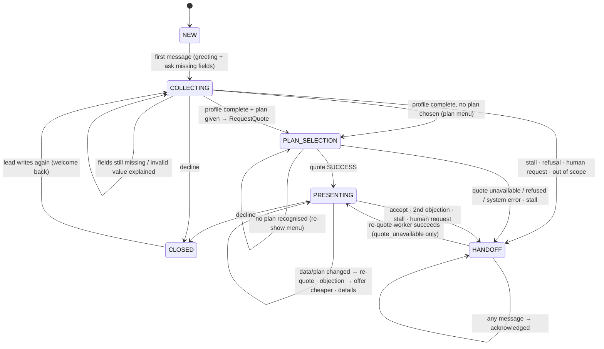
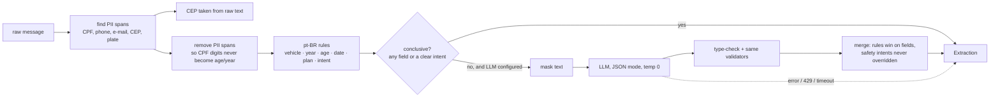

# Conversation flow

The conversation is driven by a **pure state machine** (`src/agent/fsm.py`). It receives
events and returns a `Decision`: the new snapshot, the replies to render and the effects
to execute. It never performs I/O ([ADR 0001](adr/0001-own-state-machine.md)).

## 1. State machine

| State | Meaning | Leaves when |
|---|---|---|
| `NEW` | Conversation created, nothing said yet | First event |
| `COLLECTING` | Gathering the required fields | All fields valid, decline, handoff trigger |
| `PLAN_SELECTION` | Profile complete; waiting for the plan, or a quote is in flight | Quote result, stall |
| `PRESENTING` | A quote returned by the API is on the table | Accept, decline, objection policy, re-quote |
| `HANDOFF` | A human owns the conversation | Only the re-quote worker after a `quote_unavailable` outage |
| `CLOSED` | Lead declined | Lead writes again |

Global rule, checked before any state logic: a **request for a human** or an
**out-of-scope** topic hands off from any active state
([handoff criteria](handoff-criteria.md)).

### Snapshot

`ConversationSnapshot` (in `domain/models.py`) holds everything the FSM needs: `state`,
`profile`, `stalled_turns`, `objections`, `last_quote`, `quoted_fingerprint` (a digest
of the price-relevant fields, used to detect when a re-quote is needed), `offered_plan_id`
(the cheaper plan suggested after an objection) and `handoff_reason`.

### Events → effects

| Event | Method | Possible effects |
|---|---|---|
| Text message | `on_message(snapshot, extraction, catalog, today)` | `RequestQuote`, `OpenHandoff` |
| Media (audio/image/document) | `on_media(snapshot, type)` | none (polite refusal + re-ask) |
| Quote result | `on_quote_result(snapshot, result)` | `OpenHandoff` on failure |

## 2. What is collected

Only what the quote needs ([ADR 0005](adr/0005-data-minimisation.md)). **CPF is never requested.**

| Field | Example input | Validation | Sent to `/quote` as |
|---|---|---|---|
| Vehicle model + year | "e um Corolla 2022", "Gol 14", "Onix Plus, ano 2019" | year 1950 … next year | `veiculo_ano` (the model is informational, for the seller) |
| Driver age | "tenho 35 anos", "idade: 41", "nasci em 1990", bare "35" when age is expected | 16 … 110 | `idade` |
| CEP | "cep 01310-100", "01310100" | 8 digits, normalised to `NNNNN-NNN` | `cep` |
| Start date | "hoje", "amanhã", "dia 15", "01/11", "mês que vem", "2026-12-01" | today … +90 days (`MAX_START_DATE_DAYS_AHEAD`) | `data_inicio` |
| Plan | "completo", "o 2", "o mais barato" (in plan selection) | must exist in `/planos` | `plano_id` |

The agent asks **only for what is missing**, in one message, in this order: vehicle,
age, CEP, start date. Leads usually send several fields at once. An invalid value
produces an explanation ("CEP deve ter 8 dígitos") and is not stored.

**Underwriting pre-screen.** The `/planos` payload contains the acceptance rules (driver
age bands, vehicle age bands). The FSM applies them as soon as age or vehicle year is
known, so a guaranteed refusal (e.g. "Gol 2001", a vehicle over 20 years old) is handed
off immediately without spending a quote call. The API remains the source of truth: a 422
from `/quote` is handled the same way.

## 3. Extraction pipeline

- **Rules first** (`RuleBasedExtractor`): accent-insensitive pt-BR patterns and a catalogue
  of Brazilian makes/models (`agent/vehicles.py`). Numeric model names such as "2008"
  only count when the make is mentioned, so "Gol 2008" is the year 2008, not a Peugeot.
- **LLM only when inconclusive** (`HybridExtractor`): this saves free-tier quota and
  latency. The LLM receives masked text plus the conversation state and the fields
  being waited for, and returns a JSON object (prompt `extraction-v1`, `prompts.py`).
- **Merge**: numeric fields from the rules win. CEP comes only from the rules, since the
  LLM never sees the raw CEP. `request_human` and `out_of_scope` detected by the rules can
  never be overridden by the LLM.
- **Measured** on the challenge dataset with `make eval`: 100% on age, vehicle and CEP
  across 2,500 conversations. The caveat in the README applies: the dataset is
  template-generated.

### Intents

| Intent | Examples (pt-BR) | Effect |
|---|---|---|
| `request_human` | "quero falar com um atendente", "me liga", "pessoa de verdade" | Handoff `customer_request` (any state) |
| `out_of_scope` | "bati o carro", "sinistro", "cancelar meu seguro", "procon", "seguro de vida" | Handoff `out_of_scope` |
| `accept` | "fechado", "pode emitir", "vamos nessa"; in `PRESENTING` also "sim", "pode ser", "pode mandar" | Handoff `plan_accepted`, or quote the offered cheaper plan |
| `decline` | "não quero", "deixa pra lá", "vou ficar com a outra" | `CLOSED` |
| `objection` | "achei caro", "tá salgado", "vi mais barato", "franquia alta", "vou pensar" | Offer a cheaper plan once, then handoff `negotiation` |
| `ask_details` | "o que cobre?", "franquia", "carência" | Explain coverages, deductible and waiting period |
| `greeting` | "oi", "boa tarde" | Greeting |
| `provide_info` | any message that yields fields | Collection continues |

## 4. Presenting a quote

Rendered by `responses.render()` **only from the `Quote` returned by the API**:

- monthly premium (`premio_mensal`) and plan name;
- covered items and deductible (`franquia`);
- **waiting period**: theft and robbery coverage start 30 days after the policy starts
  (`carencia`);
- **pro-rata**: when coverage starts mid-month, the first payment is proportional
  (`primeiro_pagamento_pro_rata`).

A unit test (`test_no_template_can_contain_a_price_without_a_quote`) renders every
template that is not about a quote and asserts that none contains a monthly price.

From `PRESENTING`:
- a change of data or plan → `RequestQuote`, detected by the profile fingerprint;
- `accept` → handoff `plan_accepted` (issuance and payment are human work);
- the first `objection` → the next cheaper plan is offered, and "pode ser" quotes it. A
  second objection, or an objection on the cheapest plan → handoff `negotiation`;
- `ask_details` → details; `decline` → closed; anything else → "next steps" prompt
  (counts as a stall).

## 5. Reply copy

All customer-facing text lives in `src/agent/responses.py` (pt-BR). It is the only
Portuguese in the codebase. The FSM emits `Reply(key, params)` and never builds text
itself, so the copy can be changed or translated without touching the logic.
