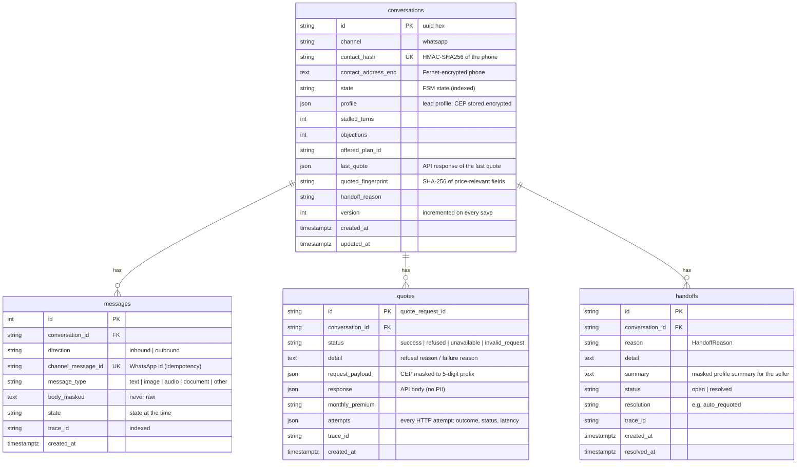

# Data model & privacy

## 1. Schema

PostgreSQL 16, managed with Alembic (`src/infra/db/migrations/`). CI checks that the
models and the migrations match (`alembic check`).

### Consistency model

- **One transaction per inbound message.** Everything a turn writes commits atomically:
  the inbound message, the quote attempts, the handoff, the snapshot and the outbound
  messages.
- **Row lock** on the conversation (`SELECT … FOR UPDATE`) serialises concurrent
  deliveries for the same lead.
- **Idempotency**: `messages.channel_message_id` is unique and is checked first, so a
  WhatsApp re-delivery is a no-op.
- **Race-safe creation**: a unique `contact_hash` plus a SAVEPOINT. If two first messages
  race, the loser re-reads the winner's row (tested against PostgreSQL with 5 concurrent
  first messages).

## 2. Personal data: what, where, how

The challenge dataset shows leads pasting CPF, e-mail, phone and plate in free text. The
design ([ADR 0005](adr/0005-data-minimisation.md)) is **don't collect, don't log, don't
store in clear**.

| Data | Needed for the quote? | Collected | Logs | Database | LLM |
|---|---|---|---|---|---|
| CPF | No | **Never asked** | `[CPF]` | masked in message bodies | masked |
| E-mail | No | No | `[EMAIL]` | masked | masked |
| Phone (WhatsApp id) | To reply | Implicit (channel) | `[REDACTED]` / `[PHONE]` | **Fernet-encrypted**, lookup by **HMAC** | masked |
| Name | No | Display name only (first name kept) | `[REDACTED]` / `[NAME]` | first name in profile; masked in bodies | masked |
| Plate | No | No | `[PLACA]` | masked | masked |
| CEP | **Yes** (regional factor) | Yes | `01310-***` | **encrypted** in profile; masked in quote payload | never sent (extracted locally) |
| Age, vehicle, dates, plan | Yes | Yes | in clear (not identifying alone) | in clear | yes |

### Masking (`src/utils/pii.py`)

`find_pii()` detects e-mail, CNPJ, CPF (formatted or 11 bare digits), phone (with or
without +55/DDD), CEP and plate (old and Mercosul formats), plus the lead's known names.
Spans never overlap, and when patterns compete the more specific one wins (CPF before
phone). `mask_text()` replaces the spans with typed tokens and keeps the CEP's 5-digit
prefix for analytics.

It runs at four boundaries:
1. **Before the LLM.** The LLM only ever sees masked text.
2. **In the logging pipeline.** `_mask_pii` is a mandatory structlog processor applied to
   every event: free text, nested dicts and lists. Sensitive keys (`sender_name`,
   `phone`, `authorization`, …) are redacted whatever their format, and keys ending in
   `_id` are left alone because they are opaque identifiers. A careless
   `log.info(body=raw_text)` is still safe.
3. **Before persisting** message bodies, and in the quote request payload.
4. **When exporting AI sessions** to the public repo (`scripts/export_ai_logs.py`). That
   step also redacts API keys, tokens, private keys and partial e-mail addresses.

### Encryption and hashing (`src/utils/crypto.py`)

- `FieldCipher`: Fernet (AES-128-CBC + HMAC-SHA256) for the contact address and the CEP.
  Key: `PII_ENCRYPTION_KEY`. **Production refuses to start without it.** Development
  derives a deterministic key from `CONTACT_HASH_SECRET` and logs a warning.
- `contact_hash`: HMAC-SHA256(phone, `CONTACT_HASH_SECRET`), the lookup key. It is
  pseudonymous: without the secret it cannot be reversed with a phone-number dictionary.
- The re-quote fingerprint is a SHA-256 digest, so the raw CEP is not stored a second time.

## 3. LGPD posture

| Principle (LGPD art. 6) | How it is addressed |
|---|---|
| Purpose & necessity | Only quote inputs are collected. CPF is left to the human closing step |
| Security | Masking at every boundary, encryption at rest, HMAC lookups, secrets in env only, gitleaks in CI |
| Prevention | Defence in depth: even a logging mistake is masked. A test asserts the reference log has no scenario PII |
| Transparency / accountability | The audit trail per conversation (`GET /conversations/{id}`) shows exactly what was processed, with masked content |

**Not implemented yet** (would be needed before production):
- a retention policy and purge job;
- data-subject requests (export/delete by contact hash);
- key rotation for `PII_ENCRYPTION_KEY`, which Fernet's `MultiFernet` supports;
- a privacy notice in the first message.

## 4. Dataset and AI logs

- `dataset/` is git-ignored. The parquet file is downloaded by `make dataset` and never
  committed, because it is PII-shaped even though it is synthetic.
- The extractor evaluation (`make eval`) also checks that **0** lead messages keep raw
  PII after masking.
- `ai-logs/` contains the sanitized Claude Code sessions. Lines stay valid JSON because
  only string values are rewritten.
