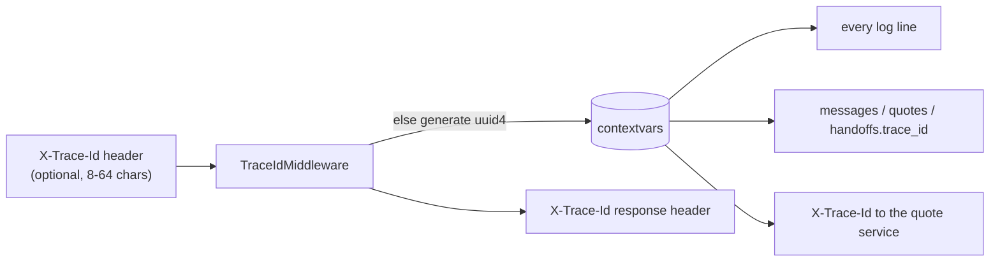

# Observability

Every turn can be reconstructed after the fact from two sources: **structured logs**
(what happened, in order, with timings) and the **audit tables** (what was decided and
stored).

## 1. Trace ids



- One `trace_id` per HTTP request or turn. Background tasks and the CLI bind their own.
- `conversation_id` is bound to the logging context as soon as the conversation is
  loaded, so a grep for either id returns the full story.
- The re-quote worker binds a new `trace_id` per conversation it retries.

## 2. Log format

JSON Lines on stdout and in `logs/execution.log` (rotating: 10 MB × 5). Every line has
`event`, `level`, `logger`, `timestamp` (UTC ISO-8601) and, when in a turn, `trace_id`
and `conversation_id`. All values pass through PII masking
([Data model & privacy](data-model-and-privacy.md#masking-srcutilspiipy)).

```json
{"operation": "quote", "attempt": 1, "outcome": "server_error", "status_code": 503,
 "latency_ms": 2, "event": "upstream_attempt", "trace_id": "ae3b5e90…",
 "conversation_id": "f65c2e40…", "level": "warning", "logger": "src.tools.http_client",
 "timestamp": "2026-10-06T15:18:29.644541Z"}
```

## 3. Event catalog

| Event | Level | Emitted by | Key fields |
|---|---|---|---|
| `app_started` / `app_stopped` | info | api.app | `environment` |
| `extractor_configured` | info | bootstrap | `llm` (null = rules only) |
| `pii_encryption_key_missing_using_dev_key` | warning | bootstrap | — |
| `message_received` | info | orchestrator | `channel`, `channel_message_id`, `message_type`, `body` (masked), `state`, `new_conversation` |
| `message_duplicate_ignored` | info | orchestrator | `channel_message_id` |
| `extraction_result` | info | orchestrator | `source` (rules / rules+llm), `intent`, `fields` (names only) |
| `llm_extraction` | info | extraction | `llm`, `prompt_version`, `intent`, `fields` |
| `llm_fallback_to_rules` | warning | extraction | `reason`, `llm` |
| `llm_http_error` | warning | llm client | `status_code`, `model` |
| `state_transition` | info | orchestrator | `from_state`, `to_state` |
| `catalog_refreshed` / `catalog_refresh_failed` | info / warning | quote adapter | `plans` / `error`, `stale` |
| `quote_requested` | info | quote adapter | `quote_request_id`, `payload` (CEP masked) |
| `upstream_attempt` | info (success) / warning | http client | `operation`, `attempt`, `outcome`, `status_code`, `latency_ms`, `error` |
| `upstream_retry_scheduled` | info | http client | `operation`, `delay_s` |
| `upstream_deadline_exceeded` | warning | http client | `operation`, `attempts` |
| `upstream_call_short_circuited` | warning | http client | `operation`, `error` |
| `circuit_state_changed` | warning | resilience | `circuit`, `from_state`, `to_state`, `consecutive_failures` |
| `quote_succeeded` | info | quote adapter | `quote_request_id`, `plan_id`, `monthly_premium`, `attempts` |
| `quote_refused` | info | quote adapter | `quote_request_id`, `reason` |
| `quote_unavailable` | warning | quote adapter | `quote_request_id`, `reason` (retries_exhausted / deadline_exceeded / circuit_open) |
| `quote_invalid_request` / `quote_response_unparseable` | error | quote adapter | `status_code`, `body` / `error` |
| `handoff_created` | warning | orchestrator | `handoff_id`, `reason`, `detail`, `summary` (masked) |
| `handoff_auto_resolved` | info | orchestrator | `reason` |
| `requote_cycle` | info | worker | `candidates`, `recovered` |
| `requote_failed` / `requote_cycle_failed` | error | worker | `conversation_id` |
| `outbound_message` | info | channel | `channel`, `simulated`, `body` (masked) |
| `outbound_send_failed` | error | orchestrator | `error` |
| `webhook_signature_invalid` | warning | webhook | — |
| `message_processing_failed` | error | webhook | stack trace |
| `log_file_unavailable` | warning | logging | `error` |
| `simulation_*` | info | simulation | `scenario`, `passed`, `failures` |

Handoffs are logged at `warning` so they show up in standard alerting without extra
configuration.

## 4. Audit API

`GET /conversations/{conversation_id}` returns the whole timeline from the database. The
`X-Api-Key` header is required when `ADMIN_API_KEY` is set. In production without a key
the endpoint is disabled.

```json
{
  "id": "…", "state": "presenting", "handoff_reason": null,
  "messages": [{"direction": "inbound", "body": "Tenho 35 anos, cep 01310-***, cpf [CPF]", "state": "collecting", "trace_id": "…"}],
  "quotes":   [{"status": "success", "monthly_premium": "209.90",
                "request": {"cep": "01310-***", "idade": 35, …},
                "attempts": [{"attempt": 1, "outcome": "server_error", "status_code": 500, "latency_ms": 2},
                             {"attempt": 2, "outcome": "success", "status_code": 200, "latency_ms": 8}]}],
  "handoffs": [{"reason": "plan_accepted", "summary": "vehicle=Toyota Corolla 2022; age=35; cep=01310-***; …", "status": "open"}]
}
```

## 5. Health

| Endpoint | Meaning | Fails when |
|---|---|---|
| `GET /health` | Liveness (process up) | never, while the process serves |
| `GET /ready` | Readiness + diagnostics: DB ping, breaker states, catalog cached | DB unreachable (503) |

`/ready` deliberately does **not** fail when the quote API is down. The agent keeps
serving by handing off, and taking it out of the load balancer would make things worse.

## 6. Investigating a conversation (runbook)

```bash
# 1. Find the conversation from a known trace id (e.g. from a webhook response)
grep '"trace_id": "<id>"' logs/execution.log | head -1 | jq -r .conversation_id

# 2. Its full story in order
grep '"conversation_id": "<cid>"' logs/execution.log | jq -c '{timestamp, event, state, to_state, outcome, reason}'

# 3. Every upstream attempt for its quotes
grep '"conversation_id": "<cid>"' logs/execution.log | jq -c 'select(.event=="upstream_attempt")'

# 4. Database view
curl -s -H "X-Api-Key: $ADMIN_API_KEY" localhost:8080/conversations/<cid> | jq
```

Useful aggregate questions, answerable from the logs today:
- handoff rate by reason: count `handoff_created` grouped by `reason`;
- quote reliability: the share of `upstream_attempt` events per `outcome`, and how many
  attempts each success took;
- breaker health: `circuit_state_changed` events over time.

## 7. Next steps

Export metrics (Prometheus/OpenTelemetry): quote latency histogram, attempts per quote,
breaker state gauge, and handoffs by reason. Also propagate the trace id as W3C
`traceparent`. The structured logs already carry every field needed.
