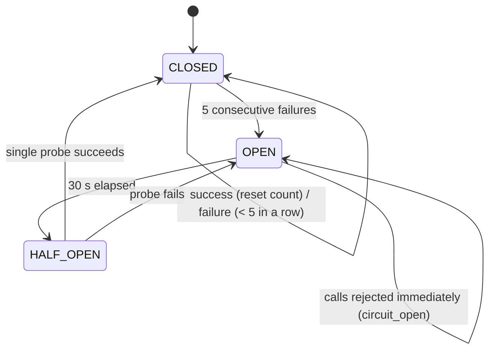

# Resilience

The legacy quote service is unreliable by design: 20% of `/quote` calls return
500/502/503, and 10% sleep 8 seconds. This page describes how the agent stays responsive
and correct anyway. The numbers and their rationale are in
[ADR 0004](adr/0004-resilience-policy.md).

## 1. Principles

1. **Bound every wait.** Each attempt has a timeout and each quote a total budget, so a
   lead is never left hanging.
2. **Retry only what can succeed on retry.** Transient failures are retried. Business
   refusals and our own bugs are not.
3. **Fail fast when the dependency is down.** A circuit breaker stops piling requests on
   a system that cannot answer.
4. **Degrade honestly.** If no quote is possible, the lead is told the truth and a human
   takes over. A price is never estimated, cached or guessed.
5. **Recover automatically.** When the API comes back, pending leads get their quote
   without human work.

## 2. Failure taxonomy

| Upstream outcome | Classified as | Retried | Counts against breaker | Agent behaviour |
|---|---|---|---|---|
| 200 with a valid body | success | — | resets it | Present the quote |
| Timeout (attempt > 3 s) | transient | ✅ | ✅ | Retry |
| Connection error | transient | ✅ | ✅ | Retry |
| 500 / 502 / 503 / 504 | transient | ✅ | ✅ | Retry |
| 429 | transient | ✅ (honours `Retry-After`, capped at 5 s) | ✅ | Retry |
| 422 `cotacao_recusada` | business refusal | ❌ | ❌ (upstream is healthy) | Handoff `underwriting_refusal` with the API's reason |
| 400 / other 4xx | our bug | ❌ | ❌ | Handoff `system_error` + error log, no price |
| 200 with an unparseable body | our bug or contract drift | ❌ | — | Handoff `system_error`, no price |
| Breaker open | short-circuit | ❌ | — | Handoff `quote_unavailable` |

Implemented in `ResilientHttpClient.request()` (`src/tools/http_client.py`) and mapped
to domain outcomes (`QuoteStatus`) by `HttpQuoteService.quote()` (`src/tools/quote_client.py`).

## 3. Timeouts, budget and retries

| Setting | Default | Env var |
|---|---|---|
| Per-attempt timeout | 3 s | `QUOTE_ATTEMPT_TIMEOUT_S` |
| Total budget per quote | 12 s | `QUOTE_TOTAL_DEADLINE_S` |
| Max attempts | 4 | `QUOTE_MAX_ATTEMPTS` |
| Backoff base / cap | 0.4 s / 3 s | `QUOTE_BACKOFF_BASE_S`, `QUOTE_BACKOFF_MAX_S` |

**Backoff with full jitter:** `delay = uniform(0, min(cap, base × 2^(attempt-1)))`.
Jitter spreads the retries of many concurrent conversations and avoids synchronized
retry storms against an already struggling legacy system.

**Deadline awareness:** each attempt's timeout is `min(3 s, remaining budget)`, and the
client does not sleep if what is left after the sleep cannot fit a useful attempt. It
raises `deadline_exceeded` instead.

**Why these numbers:** a healthy call answers in milliseconds, and the "slow" failure
mode is 8 s, so 3 s cuts it early. With about 30% of attempts failing, the chance that
all 4 attempts fail by chance is ≈ 0.3⁴ ≈ 0.8%. 12 s is an acceptable wait in a chat.

**User feedback while retrying:** the first failed attempt triggers a retry hook, and
the lead receives "Só um instante, o sistema de cotação está um pouco lento…" exactly
once per quote. The pending replies are flushed first, so the conversation stays in order.

## 4. Circuit breaker



- One breaker per upstream operation: `quote-api` and `catalog-api`. A flaky `/quote`
  does not block the plan catalog. The LLM has its own breaker (3 failures → open 60 s).
- In `HALF_OPEN` exactly **one** probe is allowed. Concurrent calls are still rejected.
- Every transition is logged (`circuit_state_changed`) and the current state is exposed
  at `GET /ready`.
- All methods are synchronous, so check-and-update cannot race within the event loop.

Settings: `BREAKER_FAILURE_THRESHOLD` (5), `BREAKER_RECOVERY_TIMEOUT_S` (30).

## 5. Plan catalog (`/planos`)

Cached for `CATALOG_CACHE_TTL_S` (300 s), with **stale-while-error**: if a refresh fails,
the last good catalog keeps being used. Plan names and coverages rarely change, and
**prices are never cached**, because every price comes from a fresh `/quote`. If the
catalog was never fetched, the agent cannot show plans and hands off (`quote_unavailable`,
detail `catalog_unavailable`). The cache is warmed at startup.

## 6. Re-quote worker

`RequoteWorker` (`src/agent/requote_worker.py`) runs every `REQUOTE_INTERVAL_S` (60 s):

1. finds open handoffs with reason `quote_unavailable` created in the last
   `REQUOTE_MAX_AGE_S` (30 min) whose conversation is still in `HANDOFF`;
2. re-quotes each one under the conversation's row lock;
3. on success: the lead receives "o sistema voltou" plus the quote, the conversation
   goes back to `PRESENTING`, and the ticket is resolved as `auto_requoted`;
4. on failure: the failed attempt is recorded and the conversation stays with the human.

Failures are isolated per conversation, so one bad conversation does not stop the cycle.
`REQUOTE_WORKER_ENABLED=false` disables the worker.

## 7. LLM failures

The LLM is optional. Any error (HTTP 429/5xx, timeout, invalid JSON, open breaker) makes
`HybridExtractor` fall back to the rule-based result and log `llm_fallback_to_rules`.
The conversation never fails because of the LLM.

## 8. Outbound delivery failures

Replies are sent after the transaction commits. A send failure is logged
(`outbound_send_failed`) and does not roll back the conversation state. A durable outbox
is a listed next step ([Operations](operations.md#7-scaling-and-next-steps)).

## 9. Evidence

| Evidence | Where |
|---|---|
| Unit tests with a fake clock: retries, jitter bounds, `Retry-After`, deadline, breaker transitions, half-open single probe | `tests/unit/test_resilience.py`, `tests/unit/test_http_client.py` |
| Outcome mapping 200/422/400/unavailable/unparseable | `tests/unit/test_quote_client.py` |
| Outage then recovery, including the breaker opening during recovery | `tests/e2e/test_scenarios.py` |
| Total outage never shows a price | `test_total_outage_never_invents_a_price` |
| Reference run, default chaos | [`logs/reference/transcript.txt`](../logs/reference/transcript.txt) |
| Reference run, high chaos (timeouts, open circuit, handoffs) | [`logs/reference/high-chaos-transcript.txt`](../logs/reference/high-chaos-transcript.txt) |

Try it yourself:

```bash
QUOTE_FAILURE_RATE=0.5 QUOTE_SLOW_RATE=0.3 docker compose up -d quote-service
docker compose exec agent python -m src.main --run-simulation
grep -E 'upstream_attempt|circuit_state_changed|handoff_created' logs/execution.log
```
