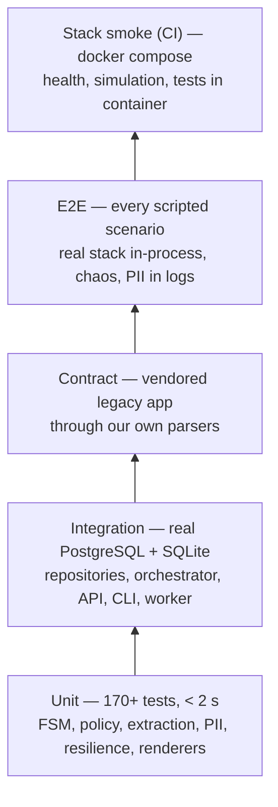
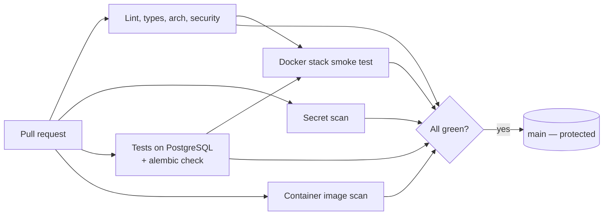

# Testing & quality

## 1. Strategy

The pure core (state machine, handoff policy, extraction, validators, masking,
resilience primitives) is where most logic lives, and it is tested without mocks or I/O.
Adapters are tested against real infrastructure (PostgreSQL, the real legacy app over
ASGI). Scenarios run end to end exactly as the demo does.

## 2. Suites

| Suite | Path | What it proves |
|---|---|---|
| Unit | `tests/unit/` | Every FSM transition and handoff reason; extraction on pt-BR phrasings (parametrised tables); PII masking, including property-based tests (Hypothesis) for CPF and e-mail; backoff bounds; breaker states; HTTP outcome mapping; renderers never show a price without a quote; webhook parsing and signature; AI-log sanitizer |
| Integration | `tests/integration/` | Repositories on **SQLite and PostgreSQL** (round-trip, encryption at rest, rollback, idempotency, race-safe creation); orchestrator (masking in DB, duplicates, ordered "just a moment" notice, send failures, outage → worker recovery); HTTP API (handshake, sync/async webhook, signature, audit API auth, trace header); CLI and worker loop |
| Contract | `tests/contract/` | The vendored legacy service still returns what our parsers expect: catalog, multipliers, pro-rata, 422 refusals, chaos 5xx |
| E2E | `tests/e2e/` | All scenarios in `src/simulation/scenarios.yaml` pass; **no scenario PII reaches the execution log**; total outage never shows a price; re-runs against the same DB start fresh; recovery survives the breaker opening |

PostgreSQL for integration tests comes from `TEST_DATABASE_URL` (the CI service, or the
compose `autoquote_test` database), otherwise from testcontainers, otherwise the
PostgreSQL variants are skipped.

## 3. Determinism

- **Time:** `Clock` is injected. `FakeClock` advances only when something sleeps, so
  retry and breaker tests run instantly and never flake.
- **Randomness:** jitter takes an injectable `random.Random`. The legacy app's chaos is
  disabled in tests by patching its rates, or scripted (`_ScriptedRng`) when a test needs
  "fail exactly once".
- **Faults:** `FaultInjectingTransport` returns 503 for the first *N* `/quote` calls,
  which is deterministic, unlike the service's random chaos.
- **No network:** `respx` mocks HTTP; the legacy app runs in-process via
  `httpx.ASGITransport`.
- **Warnings are errors** (`filterwarnings = error`). Two real bugs, a deprecated
  Starlette constant and leaked log file handles, were caught this way.

## 4. Quality gates

| Gate | Tool | Local | CI job |
|---|---|---|---|
| Lint (bugs, security, complexity, imports, pyupgrade…) | ruff | `make lint` | Lint, types, security |
| Formatting | ruff format | `make lint` | Lint, types, security |
| Static types | mypy `--strict` (src + scripts) | `make type` | Lint, types, security |
| Architecture boundaries | import-linter (4 contracts) | `make arch` | Lint, types, security |
| SAST | bandit | `make security` | Lint, types, security |
| Vulnerable dependencies | pip-audit | `make security` | Lint, types, security |
| Secrets | gitleaks | pre-commit | Secret scan |
| Tests + branch coverage ≥ 85% (currently ~95%) | pytest, coverage | `make test` | Tests |
| Migrations match models | alembic check | `make migrations-check` | Tests |
| Image vulnerabilities (fixable HIGH/CRITICAL) + Dockerfile misconfig | Trivy | `make scan` | Container image scan |
| Whole stack works | docker compose, simulation, tests in container, PII grep (fail-closed) | `make up && make simulate` | Docker stack smoke test |

`make check` runs lint, types, architecture, security and tests, the same gates as CI
except the image scan and the stack smoke test.

## 5. CI/CD pipeline

- `main` is **protected**: changes go through a pull request; all 5 checks are required
  and the branch must be up to date; history is linear (rebase merges); force pushes
  and deletion are blocked; admins are included.
- **Dependabot** opens weekly grouped updates for uv (the agent only; the vendored legacy
  service is excluded on purpose, see [ADR 0008](adr/0008-vendor-legacy-service-unchanged.md)),
  Docker base images and GitHub Actions. Each update goes through the same gates.
- Commits follow [Conventional Commits](https://www.conventionalcommits.org/).

## 6. Writing tests: conventions

- Prefer testing the pure layer (FSM, policy, extraction) with plain data. Reach for
  the orchestrator or the API only for wiring.
- Use the fakes in `tests/fakes.py` (`FakeQuoteService`, `RecordingSender`, `FakeLLM`)
  instead of ad-hoc mocks.
- New conversation behaviour → add a scenario to `src/simulation/scenarios.yaml`, so it
  is covered by the E2E suite and shows up in the demo.
- Never put real-looking secrets in tests. Assemble fake keys at runtime (see
  `test_export_ai_logs.py`) so secret scanners stay quiet.
